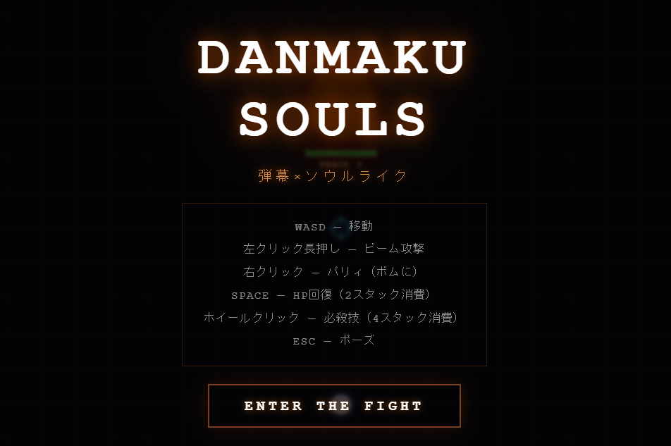
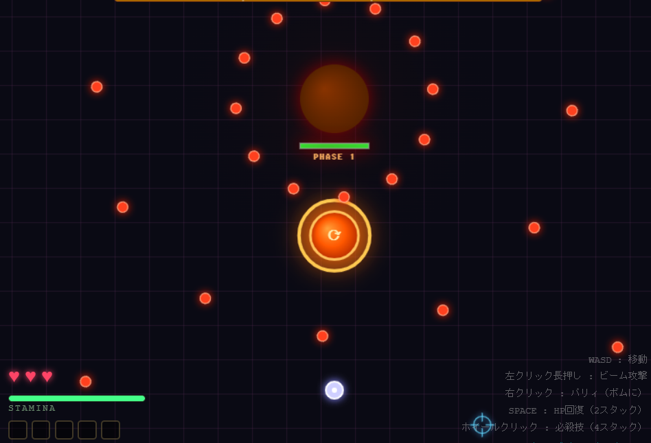
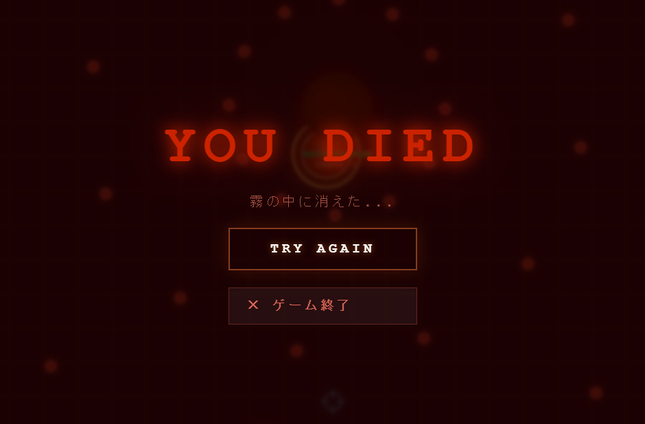

# DANMAKU SOULS

> 弾幕 × ソウルライク アクションゲーム  
> Vite + React + TypeScript + Electron + Zustand + Canvas API

---

## 概要

**Danmaku Souls** は、弾幕シューティングの「弾を避ける快感」とソウルライクの「スタミナ管理・パリィ・重厚な戦闘感」を融合させたデスクトップ専用アクションゲームです。

---

## スクリーンショット

### タイトル画面


### プレイ中


### ゲームオーバー


---

## 操作方法

| キー / ボタン | アクション |
|---|---|
| `W` / `A` / `S` / `D` | 移動（スタミナ消費） |
| 左クリック長押し | ビーム攻撃（カーソル方向） |
| 右クリック | パリィ（ボムに対して） |
| `Space` | HP回復（スタック2消費） |
| ホイールクリック（中ボタン） | 必殺技発動（スタック4消費） |
| `Escape` | ポーズ / 再開 |

---

## ゲームシステム

### スタミナ制
移動でスタミナを消費。スタミナが切れると移動速度が低下。停止中は自動回復（ディレイあり）。

### ビーム攻撃
左クリック長押しでカーソル方向へビームを発射。スタミナ消費なし、長押しで連続ヒット。  
必殺技中はビームのダメージが3倍・連射速度が上昇する。

### ジャスト回避 (Reflex)
弾がプレイヤーのギリギリを通過すると **スタミナが即時回復** し、シアンのエフェクトが発生。

### パリィ (Parry)
ボスが投擲する **巨大ボム** に対して、接近したタイミングで右クリック。  
- 判定ウィンドウは **右クリックから約8フレーム以内**（≈0.13秒）と厳しめ  
- 距離条件あり（ボムが近くに来たときのみ有効）  
- 成功するとボムを無効化し、**スタック +1**・**2秒間無敵**・体幹（ポイズ）削り  
- 体幹がゼロになるとボスがスタン状態になり大きなスキができる

### スタックゲージ
パリィ成功でたまるリソース（最大5）。

| 消費 | 効果 |
|---|---|
| スタック 2 | `Space` → HP +1 回復 |
| スタック 4 | ホイールクリック → **必殺技**発動 |

### 必殺技
発動時にボスへ **即時100ダメージ** を与え、さらに3秒間ビームがパワーアップ（ダメージ3倍・高速）。  
合計で非常に大きなダメージを与えられる切り札。

### ボス・フェーズ制
ボスのHPに応じて攻撃パターンが3段階で激化する。

| フェーズ | HP割合 | 弾数 | 弾速 | ボム間隔 |
|---|---|---|---|---|
| Phase 1 | 100% ～ 60% | 12方向 | 遅め | 長い |
| Phase 2 | 60% ～ 30% | 16方向 | 中速 | 中 |
| Phase 3 | 30% ～ 0% | 20方向（可変速） | 速い | 短い |

### 演出
- **予兆エフェクト**: 弾幕・ボム発射直前にボス周囲が赤く点滅
- **ヒットストップ**: 被弾・パリィ成功時に一瞬時間が止まる
- **画面揺れ (Screen Shake)**: 着弾・体幹崩し・必殺技でウィンドウが振動
- **パーティクル**: ヒット・パリィ・必殺技でエフェクト発生
- **カスタムカーソル**: 十字線照準、必殺技中は金色に変化

---

## 技術スタック

| 技術 | 用途 |
|---|---|
| Electron 30 | デスクトップアプリ化 |
| React 18 + TypeScript | UIレンダリング |
| Vite 5 | ビルドツール / 開発サーバー |
| Zustand 5 | グローバル状態管理 |
| Canvas API | ゲーム描画（60fps） |
| electron-builder | パッケージング |

---

## ディレクトリ構成

```
danmaku-soul/
├── electron/
│   ├── main.ts          # Electron メインプロセス
│   └── preload.ts       # プリロードスクリプト
├── src/
│   ├── game/
│   │   ├── types.ts         # 型定義（Player, Boss, Bullet 等）
│   │   ├── constants.ts     # ゲーム定数
│   │   └── useGameLoop.ts   # ゲームループ・物理・当たり判定
│   ├── store/
│   │   └── gameStore.ts     # Zustand ストア
│   ├── components/
│   │   ├── GameCanvas.tsx   # Canvas 描画コンポーネント
│   │   ├── HUD.tsx          # HP / スタミナ / スタック / ボスHP 表示
│   │   └── Screens.tsx      # タイトル / ポーズ / 死亡 / クリア画面
│   ├── App.tsx
│   └── index.css
├── public/
├── vite.config.ts
├── tsconfig.json
└── package.json
```

---

## ビルド・配布

### 開発サーバー起動

```bash
npm run dev        # Electron + Vite HMR
npm run lint       # Lint チェック（0 warnings 必須）
npm run preview    # Vite プレビュー
```

### .exe ビルド

```bash
npm run build
```

成功すると以下が生成されます。

| パス | 内容 |
|---|---|
| `release/win-unpacked/Danmaku Souls.exe` | そのまま起動できるポータブル版 |
| `release/Danmaku Souls *.exe` | インストーラー（開発者モード有効時のみ生成） |

> **注意**: Windows でインストーラー（単一 `.exe`）を生成するには、**設定 → システム → 開発者向け → 開発者モード** をオンにする必要があります。開発者モードなしでも `release/win-unpacked/` フォルダをそのまま配布・実行できます。

---

## 開発メモ

- ゲームループは `requestAnimationFrame` ベース。ヒットストップ中はロジックをスキップし、描画のみ継続
- ビームタイマー・パリィ判定フレームは `useRef` で管理し、Zustand のスナップショットタイミングに依存しない設計
- 状態管理は Zustand の `getState()` をループ内で直接呼び出し、サブスクライブを回避
- パリィ判定は距離条件＋8フレームウィンドウによるシビアなタイミング制
- 弾幕パターンは `generateDanmaku()`・ボムは `generateBomb()` で管理し、フェーズごとに拡張可能
